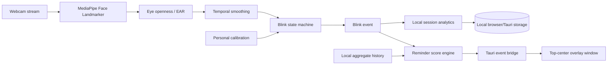

# Veya

A privacy-first desktop companion that gently reminds you to blink while you work.

Veya uses on-device face landmarks to notice changes in a person’s natural blink rhythm. When blinking becomes unusually infrequent, a small always-on-top capsule appears near the webcam. A detected blink acknowledges and dismisses it immediately.

Veya is a screen-wellbeing companion, not a medical device. It does not diagnose, prevent, or treat eye strain, dry eye, fatigue, or any other condition.

## What is included

- Local webcam capture with explicit permission and polished error states
- MediaPipe Face Landmarker inference at approximately 15 Hz
- Aspect-ratio-corrected EAR-style openness for each eye
- Short-window smoothing and a temporal blink state machine
- Personalized open/closed-eye calibration
- Confidence gating for no face, partial face, head turn, and unstable eyes
- A scored reminder engine based on no-blink time, relative rate drop, personal history, confidence, and cooldown
- A dedicated top-center, borderless Tauri overlay window
- Local session statistics, rolling rate, history, and rhythm timeline
- Pause/resume, sensitivity, appearance, recalibration, and genuine local-data deletion
- Light, dark, and system appearance modes with reduced-motion support
- A hidden simulation/tuning panel
- Unit tests for blink detection, calibration, reminders, and analytics

## Screenshots

Screenshot slots are intentionally reserved for the first signed macOS build so the documentation reflects the packaged desktop window and camera permission flow rather than a browser preview.

| Onboarding | Dashboard | Webcam reminder |
| --- | --- | --- |
| First-run privacy and calibration flow | Calm session overview and blink rhythm | Top-center ambient, nudge, reminder, and acknowledgement states |

## Architecture



High-frequency landmarks remain inside `MonitoringService` and are not placed in React state. The UI store is updated at a lower cadence, while calibration can subscribe directly to eye metrics. This keeps inference concerns separate from rendering and leaves a clear boundary for a future worker migration.

The main areas are:

```text
src/
  components/             reusable visual primitives
  features/
    camera/               webcam ownership and errors
    face/                 MediaPipe and eye openness
    blink/                temporal blink state machine
    calibration/          personalized thresholding and flow
    monitoring/           local pipeline orchestration
    reminders/            score engine and Tauri overlay bridge
    analytics/            rolling rates and session aggregation
    settings/             preferences and privacy controls
    debug/                simulation and tuning panel
  lib/                    central configuration and local storage
  stores/                 low-frequency external monitoring store
  types/                  shared domain contracts
  pages/                  onboarding and dashboard
src-tauri/                native desktop shell and two-window config
```

## Privacy model

Camera frames are passed directly from the in-memory video stream to MediaPipe and are not saved. Veya contains no backend, account system, telemetry client, remote database, or inference API. It does not upload video, frames, photos, screenshots, facial landmarks, or blink history.

The packaged face model and WebAssembly runtime live in `public/`, so inference does not need a network connection after installation. The only persisted data is:

- reminder and appearance preferences;
- the user’s numeric calibration profile;
- aggregate session summaries and minute-level blink-rate points;
- a periodically refreshed aggregate summary of the current session, used to recover from an interrupted exit.

“Delete local data” removes every Veya storage key, including calibration and recovered-session data. The user must recalibrate afterward.

## Prerequisites

- Node.js 20 or newer
- npm 10 or newer
- Rust stable and platform prerequisites for Tauri 2
- macOS 11+ for the primary V1 target, or a supported Windows development environment

Follow the official [Tauri prerequisites](https://v2.tauri.app/start/prerequisites/) for Xcode Command Line Tools on macOS or WebView2/MSVC on Windows.

## Setup

```bash
git clone https://github.com/Kumaryan12/Veya.git
cd Veya
npm install
```

`npm install` copies the pinned MediaPipe WebAssembly files from the installed package into `public/mediapipe`. The face landmark model is committed at `public/models/face_landmarker.task`, allowing packaged inference to work offline.

## Development commands

Run the frontend in a browser for layout and simulation work:

```bash
npm run dev
```

Run the complete desktop app:

```bash
npm run tauri dev
```

Open `http://localhost:1420/?debug=true&demo=true` during frontend development to bypass onboarding with simulated normal blinking. The debug panel can also be toggled with <kbd>Cmd/Ctrl</kbd>+<kbd>Shift</kbd>+<kbd>D</kbd> after onboarding. It provides controls for a blink, normal rhythm, no face, prolonged staring, and low confidence.

Quality checks:

```bash
npm run typecheck
npm run lint
npm run test
npm run build
```

## Build

Create the platform installer/bundle:

```bash
npm run tauri build
```

Frontend-only production output:

```bash
npm run build
npm run preview
```

## Camera permission troubleshooting

### macOS

Open **System Settings → Privacy & Security → Camera** and enable Veya. If Veya is absent, quit it fully, run `npm run tauri dev` again, and trigger **Allow camera** during onboarding. Development permission may be associated with the terminal or development app bundle; a signed packaged build receives its own entry.

### Windows

Open **Settings → Privacy & security → Camera**, enable camera access, and allow desktop apps. Also confirm no other application is exclusively holding the camera.

If a camera is disconnected or the local model cannot initialize, Veya pauses reminders. It never guesses through an unreliable tracking state.

## How blink detection works

MediaPipe supplies normalized face landmarks for one face. Veya measures two vertical eyelid distances relative to horizontal eye width, separately for each eye, with pixel-aspect correction. It smooths the resulting openness values and compares them with the user’s calibrated threshold.

A blink is not a single low frame. It must traverse `OPEN → CLOSING → CLOSED → OPENING → OPEN`, stay closed long enough to reject landmark noise, reopen for confirmation, fit within a maximum duration, and clear a cooldown. A long closure therefore cannot generate repeated blinks.

Reminder decisions combine elapsed time since the last blink, the drop from recent/personal blink rate, tracking confidence, face presence, selected sensitivity, and the previous reminder cooldown. Rates are descriptive, not judgments of health.

## Known limitations

- Webcam and reminder behavior vary with lighting, glasses, camera angle, and individual anatomy; recalibration and manual sensitivity tuning may be needed.
- V1 uses the main display for initial overlay placement. Following an active window between monitors is a future enhancement.
- Inference runs on the main webview thread. The cadence is capped and UI updates are throttled, but a worker/OffscreenCanvas path would improve headroom on older machines.
- The overlay uses Tauri’s supported transparent-window configuration; on macOS this enables Tauri’s `macos-private-api` feature. Windows transparency and focus behavior require platform QA.
- Closing the main window exits the app in V1. Minimize it to keep monitoring active.
- Blink detection is heuristic and not clinically validated.

## Roadmap

Highest-priority V2 work:

1. Signed macOS and Windows builds with a camera/overlay hardware test matrix.
2. Move landmark inference to a worker where browser support allows it.
3. Follow the active display while preserving non-focusable, click-through behavior.
4. Add a menu-bar/system-tray controller for reopening and explicit quit.
5. Improve automatic calibration recovery and build an opt-in local tuning harness across lighting and eyewear conditions.
6. Add export/import for user-owned aggregate data without introducing cloud storage.

## Contributing

Keep Veya local, calm, and narrowly focused. Before opening a pull request, run all four quality commands above. Add tests for changes to calibration, blink state transitions, statistics, or reminders. Avoid medical claims and do not add telemetry, remote inference, accounts, or frame persistence without an explicit product decision and privacy review.

## License

MIT is recommended and included in [LICENSE](LICENSE). MediaPipe Tasks Vision is distributed under its own Apache-2.0 terms, and the bundled model/runtime should retain upstream notices in release packaging.

